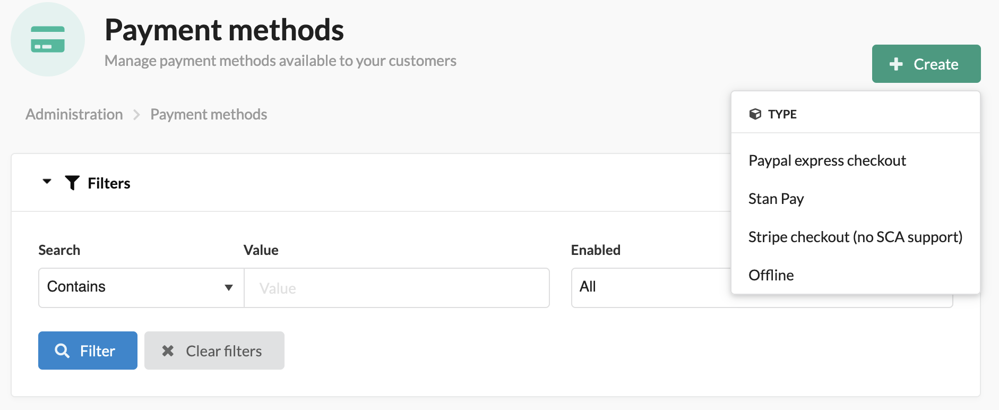
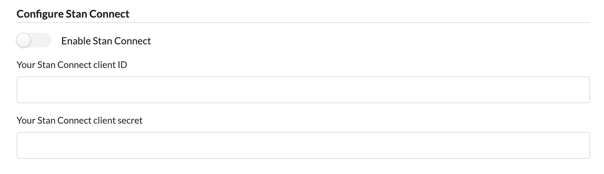

# Stan Configuration

1. Go to "Payment Methods" in admin menu and click on "+ Create". Choose "Stan Pay"

    

1. Put your API keys in the fields

    

1. Put your Stan Connect keys in the fields under Stan Connect section

    

---

Prev: [Onboarding](onboarding.md)
