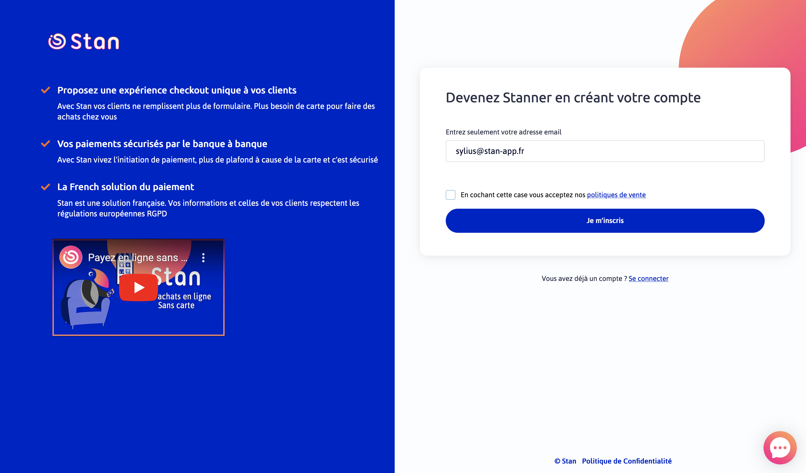
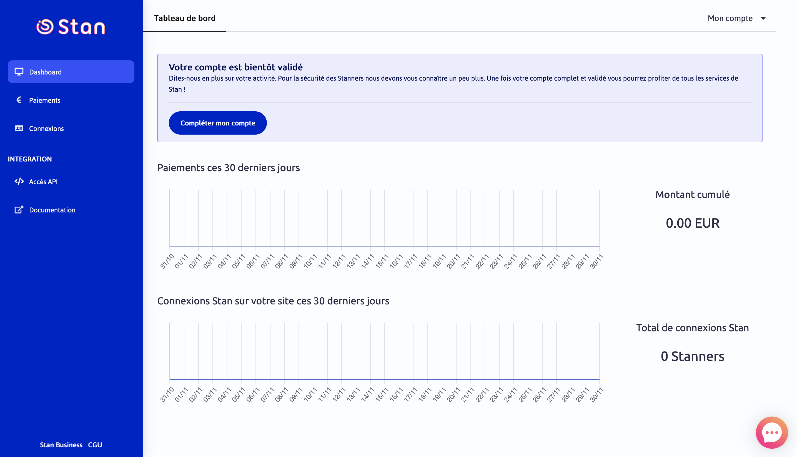
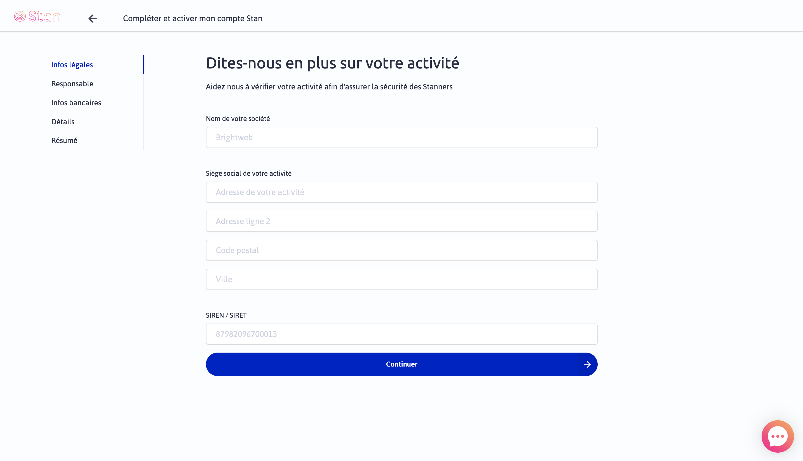
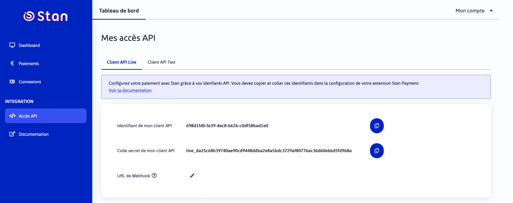
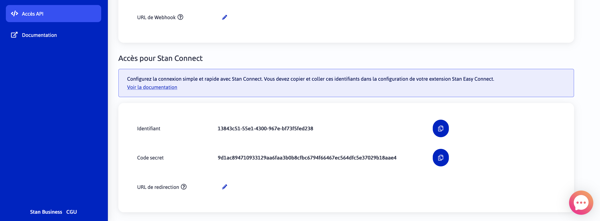

# Onboarding in Stan

To be able to use the Stan Connect integration, you need to onboard with your Stan business account.

1. Go to [https://compte.stan-app.fr](https://compte.stan-app.fr) with only your email address

    

1. Login to your newly created Stan Account

    

1. Fill your account information

    

1. Find your Stan Pay API keys in "Accès API" section

    
    
1. Find your Stan Connect API keys in "Accès API" section

    
    
You're all setup 🎉 Stan team will validate your account as fast as possible

---

Prev: [Installation](installation.md)
Next: [Configuration](configuration.md)
